# Travel Sample Application

Couchbase Travel is a sample web application that shows you how to interact with the Couchbase query services via the software development kits (SDKs).

Each SDK comes with its own implementation of the backend for the application. You can download the complete source code and then build and run the app. 

While the app runs, you can see what happens in the backend through the **Narration** (a console like UI element that can display N1QL queries for instance). 
<br>**Note:** The **Narration** is only visible in components that communicate with the server and can can collapsed.

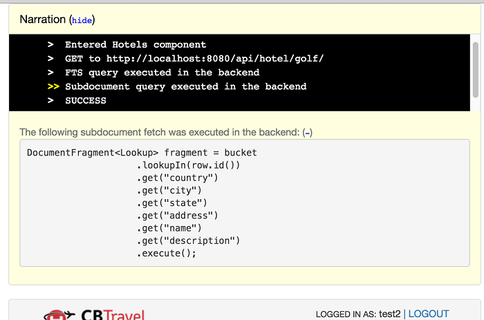

The documentation for the travel app illustrates the data model and walks through the N1QL and FTS queries used to select flights and search for hotels.

## **Generic Set Up**

You'll need:
- Your favorite editor or EID.
- Your SDK of choice and any specific dependencies
- A local Couchbase 4.5 (or greater) installation (make sure that the travel-sample bucket has been loaded from 4.5 and that there is, at least, one node with `Data`, `Index`, `Query`, and `Full Text` search services in the cluster)

### **Config**
It's easiest if you run Couchbase Server and the travel sample app on the same machine. You're not required to run your development environment this way, and, if wanted, advanced managed dedciated server (MDS) configurations are supported. <br>It's just easier to start a development environment with the components running locally.

### **Install Steps**

1. Download  and install [Couchbase Server](https://www.couchbase.com/downloads) .
Follow the download instructions and setup wizard, and  make sure you select all the services services (`Data`, `Index`, `Query`, and `Full Text`): 
<br> <br> 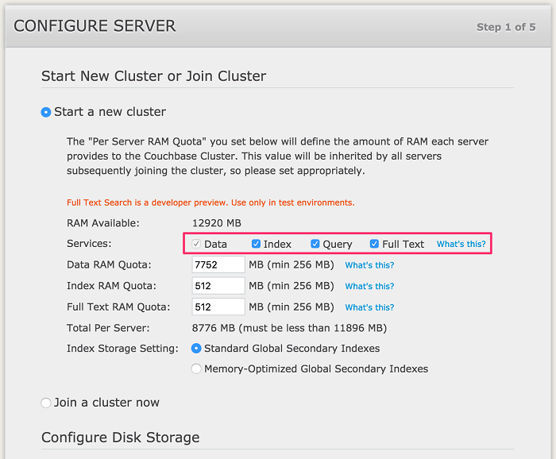

2. Make sure also you also select  the `travel-sample` sample bucket because it contains the data used in this tutorial. <br>**Note:** If you  have Couchbase Server 4.5 or later installed but did not install the `travel-sample` sample  bucket (or you installed it from a 4.0 version), open the **Couchbase Web Console** and select **Settings > Sample Buckets**. Select the `travel-sample` checkbox, and then click **Create**. A notification box in the upper-right corner disappears when the bucket is ready to use.
<br> <br> 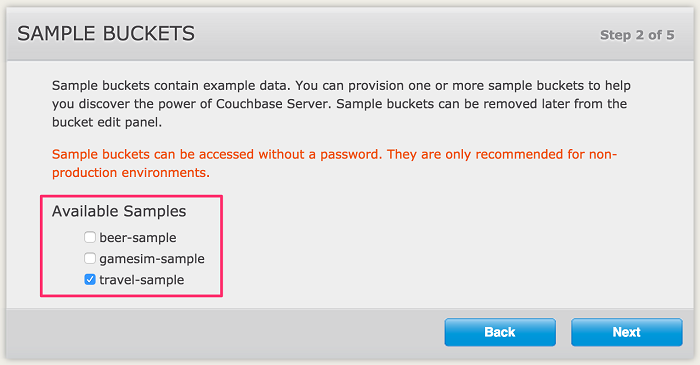

3. To to be able to search for `hotels`, a Full Text Search (FTS) index called hotels must be created on the `travel-sample` sample bucket. Select **Indexes > Full Text > New Full Text Index** and create the `hotels index` shown below:
<br>**Note:** You can make the index mapping more precise, but a generic mapping is fine for this example.
<br> <br>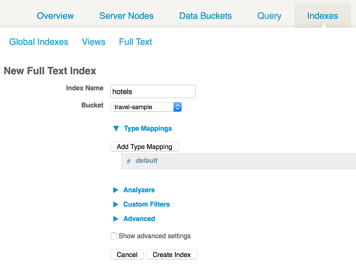

**Note:** The index mapping could be more precise, but a generic mapping will work fine for this example.

## **Using the Travel App**

Before running the application, make sure that the Couchbase Server instance is running.

### **Installation**


1. To download the application you can either download the archive or clone the repository:

 ```bash
 $ git clone https://github.com/couchbaselabs/try-cb-java.git
```
2. Now change into the directory (`$ cd try-cb-java`) and then run the following maven command.

```bash
mvn spring-boot:run
```
3. If all goes well, this will start a web server on `
127.0.0.1:8080.`

4. Open `127.0.0.1:8080` in your browser.

### **To find a flight:**


1. Open your  browser and go to to the login URL that was displayed when you started the Couchbase app.
2. Sign in to Couchbase Travel by entering your credentials, or create a new account. <br>**Note:** (the new account will expire after some time depending on the backend used, usually 1 hour
<br><br>
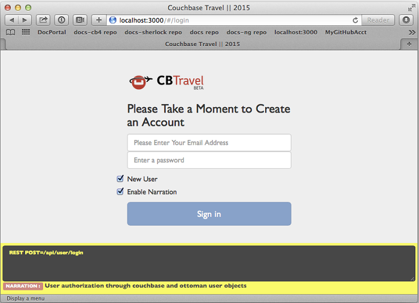

3. In the **Airport or City** section, enter an airport code or city name in the **From** and **To** fields.<br>In the **Travel Dates** section, enter **Leave** and **Return** dates in MM/DD/YYYY format. 
<br> <br>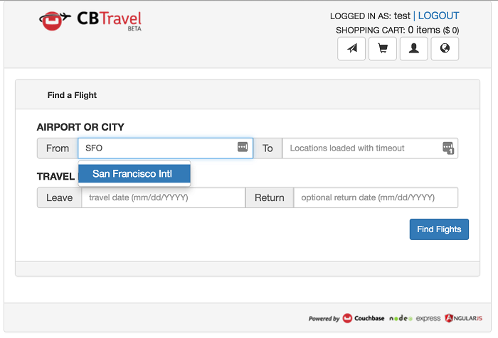

4. Click  **Find Flights**. <br>The app displays the available flights for the outbound and return legs of the trip. Select one or more flights to add to your cart by clicking the **Choose** button next to each flight.
<br> <br>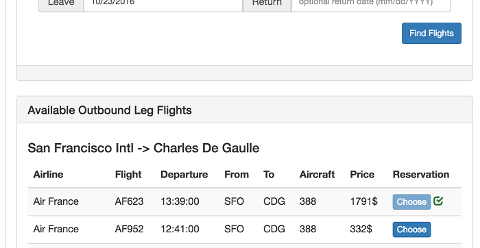
You now have flights stored locally in your cart. 
5. You should review your chosen flights before booking.

###  **To review and book flights:**

1. The number of flights in the cart and the total cost are displayed in the top-right navigation bar.
2. Click on the **cart icon** buton  in the top-right navigation bar.

3. Review the flights in your cart, and book one by clicking on the **Book** button next to it.
<br> <br>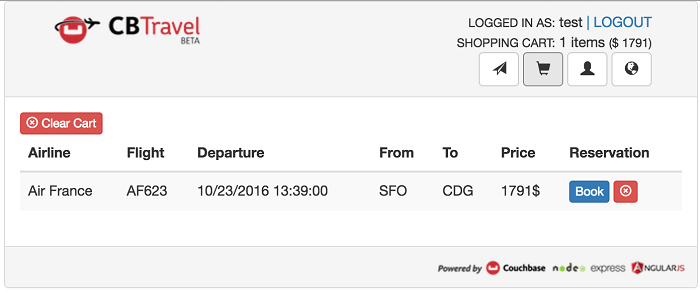

4. Your  flight is now booked, as confirmed by a message on the page.
<br> <br> 
**Note:** The flights that you've booked are stored in the backend.The backend uses authentication to control access to the endpoints for booking and listing flights. <
5.  You can see which flights you've booked on the User page. Click on the **User** button o go to the **User** page. 
<br> <br> 
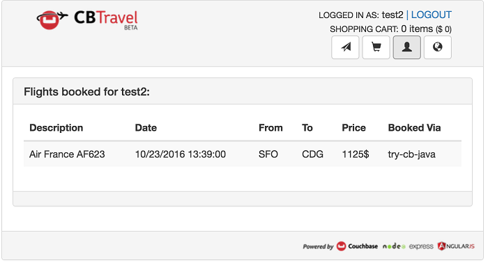

### **To Find a Hotel**

 **Warning**: You should make sure that you've installed Couchbase 4.5 with FTS enabled. The API backend that's used by the hotels page uses an FTS index that you have to create, named hotels.

1. Click on the **earth icon** button in the top-right navigation bar to go to the **Find Hotels** page. 
2. Click on the **Find Hotels** button to see the first 100 hotel results.<BR> **Note:** You can refine your search using the input fields, either by a **Description** keyword, by **Loction** or both.
<br><br>


> Warning: You should make sure that you have installed Couchbase 4.5 with FTS enabled. The API backend that is used by the hotels page makes use of an FTS index that you have to create, named hotels.

## **Using CBQ**

You can browse and access documents in Couchbase without writing any code, by using browser and command line tools. This is useful if you want to look at  cluster data without writing code. You can access individual documents using the command line and web console.

### **Using the command-line query shell (cbq)**

You can use the cbq program as a command line query shell to issue N1QL queries in couchbase.

 cbq is available on all cluster nodes and doesn't require a separate installation. <br>Simply run cbq from the Couchbase installation directory ( `/opt/couchbase/bin/cbq` on Linux and `/Applications/Couchbase Server.app/Contents/Resources/couchbase-core/bin/cbq`). Once in the shell, you'll be greeted by a prompt and ready to issue any N1QL query, such as: 

```bash

cbq> SELECT airportname FROM `travel-sample` WHERE airportname IS NOT NULL LIMIT 1;

```

### **Web Console Document Access**

You can use the Web Console to view, edit, and create JSON documents up to 2.5KB in size. 
#### **To access documents using the Web Console:**

1. In your browser navigate to a cluster node. Type the address of the cluster with the admin port (8091). <br>Use your username (usually Administrator). The password is the password you used when setting up the cluster.
2. Once logged in, go to the Data Buckets section
: <br> <br>
	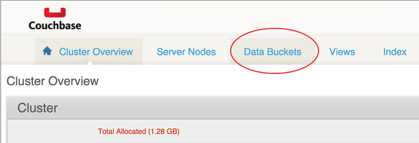

3. Click the **Documents** button of the default bucket:
<br> <br>
	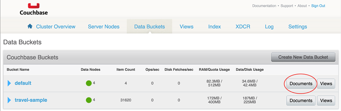
	
4. To retrieve a document, enter the document ID and click the **Lookup Id** button. 
<br> <br>
	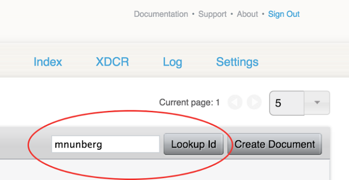
	
5. The document editor opens:
<br> <br>
	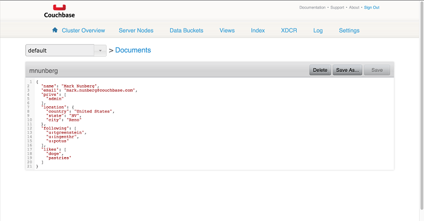
	
6. To create a new document, return to the Documents section and click the  **Create Document** button
<br> <br>
	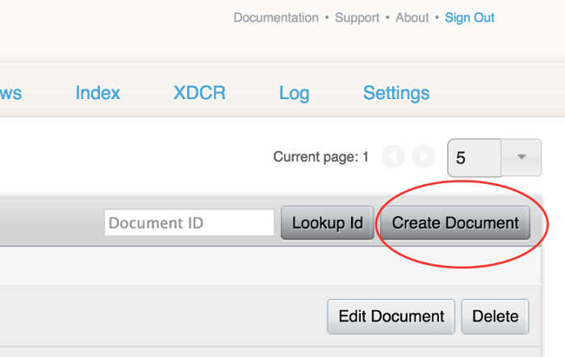

7. You’ll be asked to enter a Document ID
<br> <br>
	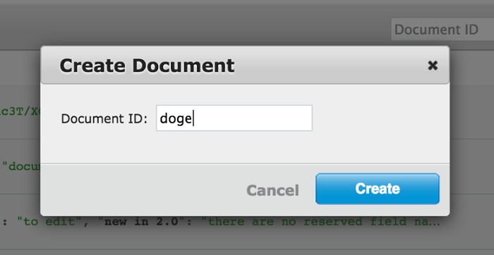

7. You can now edit your document. When done, click the **Save** or **Save As...** button.
<br> <br>
	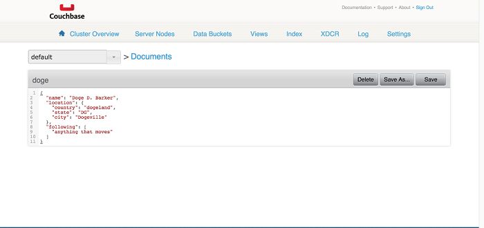